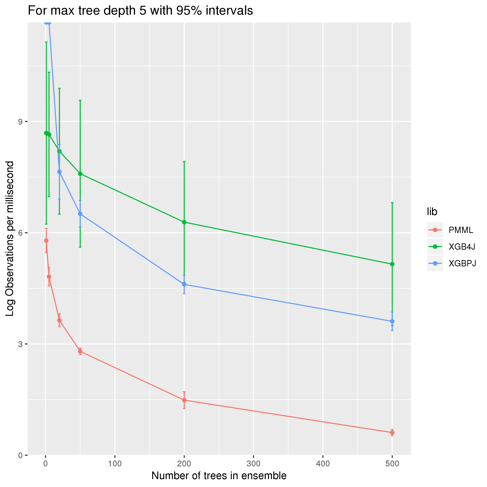

# xgboost_jvm_scoring
Comparing runtime for JVM based libraries for XGBoost model scoring. This analysis may inform library selection for time sensitive applications, such as a web requests or credit card transactions.

## XGBoost
[XGBoost](https://xgboost.readthedocs.io/en/latest/#) is a popular library for fitting gradient boosted tree ensembles. For an explanation of general tree boosting algorithms, see [here](https://github.com/holub008/snippets/blob/master/tree_learning/tree_learning_overview.pdf).

## Run example
An example is constructed using the [UCI census income dataset](https://archive.ics.uci.edu/ml/datasets/census+income).
```bash
bash run_suite.bash
```

## Example for OSX (10.12.6)
Ran 20 replicates (serial execution) for each experimental setup in the cartesian product of the following:
* trees: 1, 5, 20, 50, 200, 500
* max tree depth: 2, 3, 5

### Max tree depth 2


### Max tree depth 3


### Max tree depth 5



### Analysis
xgboost4j is notable for requiring JNI bindings. This induces some overhead (system dependent), which is why it appears that xgboost-predictor-java, which is a pure JVM library, outperforms at small tree sizes (where the overhead matters more). As ensemble size grows and overhead matters less, xgboost4j performs almost twice as well as xgboost-predictor-java.

jpmml, which attempts to provide a generic ML model evaluation, performs 1-2 orders of magnitude more poorly.

Interestingly, max tree depth does not appear to have much effect on runtimes. This is an open question.

TODO, there is an additional covariate, the batch size. This makes a difference in the analysis and should be included.
