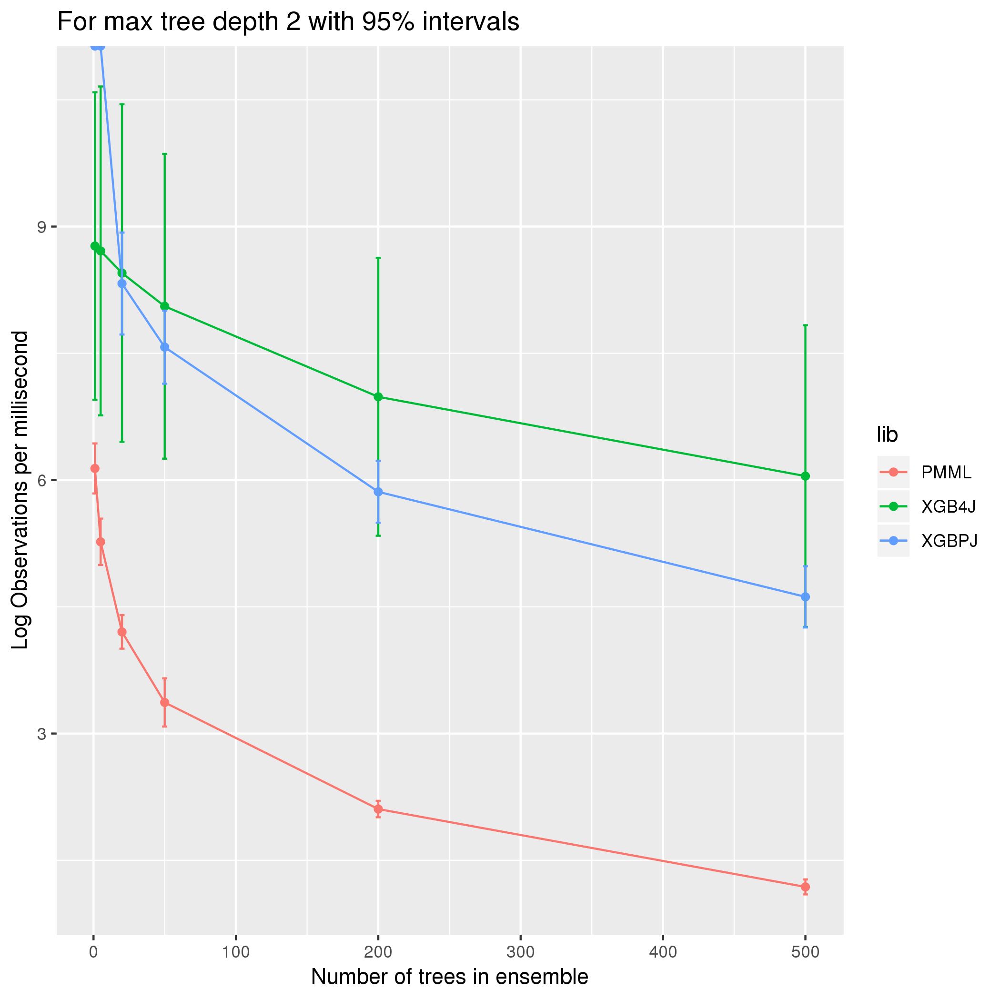
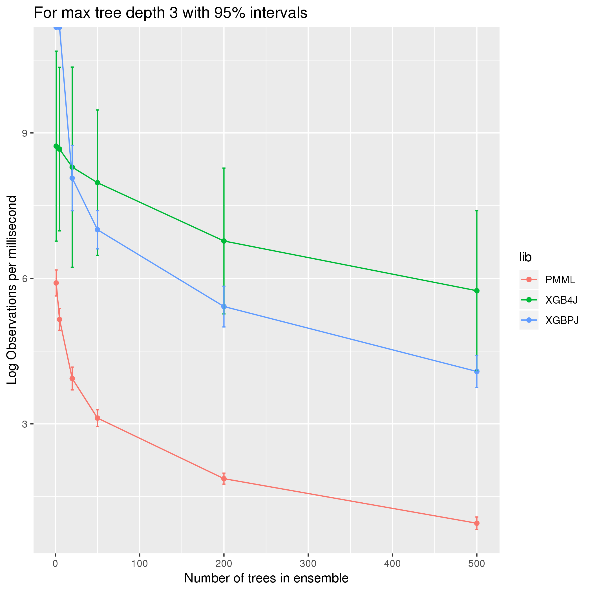

# xgboost_jvm_scoring
Comparing runtime for JVM based libraries for XGBoost model scoring. This type of analysis may inform library selection for time sensitive applications, such as a web requests or a credit card transactions.

## Running
```bash
bash run_suite.bash
```

## XGBoost
[XGBoost](https://xgboost.readthedocs.io/en/latest/#) is a popular library for fitting gradient boosted tree ensembles. For an explanation of general tree boosting algorithms, see [here](https://github.com/holub008/snippets/blob/master/tree_learning/tree_learning_overview.pdf).

## Example for CentOS 7
Ran 20 replicates (serial execution) for each experimental setup in the cartesian product of the following:
* trees: 1, 5, 20, 50, 200, 500
* max tree depth: 2, 3, 5

### Max tree depth 2



### Max tree depth 3



### Max tree depth 5


### Analysis
xgboost4j is notable for requiring JNI bindings. This induces some overhead (system dependent), which is why it appears that xgboost-predictor-java, which is a pure JVM library, outperforms at small tree sizes (where the overhead matters more). As ensemble size grows and overhead matters less, xgboost4j performs almost twice as well as xgboost-predictor-java. It does appear that xgboost4j has relatively large variances, with some overlap with xgboost-predictor-java in the 95% intervals. Again, this is hypothesized to be attributable to JNI. This suggests applications needing strict timeboxes or non-outlying prediction time should be wary of xgboost4j.

jpmml, which attempts to provide a generic ML model evaluation, performs 1-2 orders of magnitude more poorly.

Interestingly, max tree depth does not appear to have much effect on runtimes. This is an open question.

TODO, there is an additional covariate, the batch size. This makes a difference in the analysis and should be included.
